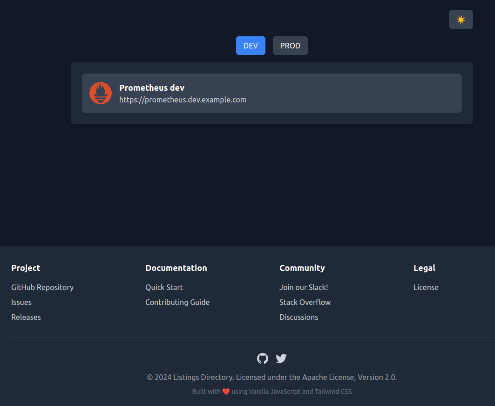

---
hide:
  - navigation
---

# Listings Directory

[](https://github.com/meysam81/listings-directory)
[](https://github.com/meysam81/listings-directory)
[](https://github.com/meysam81/listings-directory/commits/main/)
[](https://github.com/meysam81/listings-directory)
[](https://results.pre-commit.ci/latest/github/meysam81/listings-directory/main)
[](https://hub.docker.com/r/meysam81/listings-directory)
[](https://hub.docker.com/r/meysam81/listings-directory)

This is a Vanilla JS application that is built to provide
a listing directory for pages and links, possibly admin
pages that are shown to your organization personnel only.

## Usage

You can either run the app locally, or use the docker
image as below:

```json title="listings.json"
{
  "dev": [
    {
      "icon_url": "https://static-00.iconduck.com/assets.00/prometheus-icon-511x512-1vmxbcxr.png",
      "label": "Prometheus dev",
      "url": "https://prometheus.dev.example.com"
    }
  ],
  "prod": [
    {
      "icon_url": "https://static-00.iconduck.com/assets.00/prometheus-icon-511x512-1vmxbcxr.png",
      "label": "Prometheus prod",
      "url": "https://prometheus.example.com"
    }
  ]
}
```

```shell title="" linenums="0"
docker run -dp 8080:8080 \
  --name listings-directory \
  -v $(pwd)/listings.json:/public/listings.json:ro \
  ghcr.io/meysam81/listings-directory:latest
```

The docker container will have a `:8080/health` endpoint,
very useful in a Kubernetes setup with probes.

## Demo

<figure markdown="span">
  { loading=lazy }
  <figcaption>Demo Screenshot</figcaption>
</figure>

## Verify Docker Images

```shell title="" linenums="0"
cosign verify ghcr.io/meysam81/listings-directory:main \
  --certificate-identity-regexp "https://github\.com/meysam81/listings-directory/.+" \
  --certificate-oidc-issuer "https://token.actions.githubusercontent.com"
```
